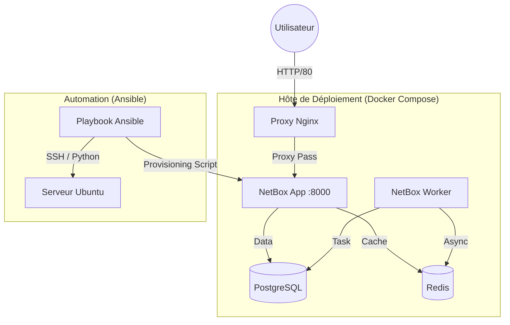

# 🚀 Déploiement Automatisé de NetBox (IPAM/DCIM)

> **Projet SAÉ 5.02** : Infrastructure as Code (IaC) pour déployer une "Source de Vérité" réseau complète, conteneurisée et pré-peuplée, sans intervention manuelle.

---

## 📖 À propos du projet

Ce projet répond à une problématique courante en entreprise : remplacer la gestion des IP sur Excel par une solution professionnelle centralisée (**NetBox**). 

L'objectif n'est pas seulement d'installer l'outil, mais d'**automatiser** l'intégralité de son cycle de vie : de la préparation du serveur à l'injection des données initiales.

### ✨ Fonctionnalités clés
* **100% Automatisé :** Déploiement via Ansible (aucun SSH manuel requis sur la cible).
* **Architecture Micro-services :** Stack Docker complète (NetBox, PostgreSQL, Redis, Worker).
* **Reverse Proxy :** Accès simplifié via Nginx (Port 80).
* **Auto-Provisioning :** Script Python injecté pour créer automatiquement le site "IUT Roanne" et les plages IP de base.
* **Zero Touch :** Le serveur cible peut être formaté, le script le remonte à l'identique en quelques minutes.

---

## 🏗️ Architecture Technique

Le déploiement s'appuie sur une machine de contrôle (Chef) qui pilote l'hôte de déploiement (Client) via SSH.

⚡ Démarrage Rapide

Suivez ces étapes pour déployer l'infrastructure sur une machine vierge.
Prérequis

    Un poste de contrôle (Linux/WSL) avec Ansible installé.

    Une machine cible (Ubuntu 22.04/24.04) accessible en SSH.

    Une clé SSH configurée entre le poste de contrôle et la cible.

1. Cloner le dépôt
Bash

git clone [https://github.com/izakali/sae502-netbox.git](https://github.com/izakali/sae502-netbox.git)
cd sae502-netbox

2. Configurer l'inventaire

Éditez le fichier inventory/hosts.ini pour renseigner l'IP de votre machine cible :
Ini, TOML

[netbox]
192.168.X.X ansible_user=votre_utilisateur_ssh

3. Lancer le déploiement

Exécutez le playbook principal. Le mot de passe sudo de la cible sera demandé (-K).
Bash

ansible-playbook site.yml -K

🖥️ Accès et Vérification

Une fois le script terminé (environ 3-5 minutes), l'application est accessible immédiatement.

    URL : http://<IP_DE_VOTRE_CIBLE> (Port 80 standard)

    Identifiant : admin

    Mot de passe : admin

Preuve de fonctionnement (Provisioning)

Rendez-vous dans les menus suivants pour vérifier l'injection automatique des données :

    Organization > Sites : Le site IUT Roanne est créé.

    IPAM > Prefixes : Le réseau 192.168.10.0/24 est déclaré.

📂 Structure du projet
Plaintext

sae502-netbox/
├── ansible.cfg          # Configuration globale Ansible
├── inventory/
│   └── hosts.ini        # Inventaire des machines cibles
├── roles/
│   ├── system_init/     # Sécurisation OS & Installation Docker
│   ├── netbox_deploy/   # Déploiement Docker Compose & Nginx
│   └── netbox_provision/# Scripts Python pour injecter les données
├── site.yml             # Playbook principal (Chef d'orchestre)
└── README.md            # Documentation
